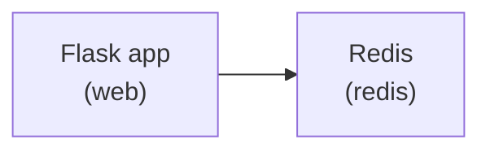

# Defining Services with Compose

A `compose.yaml` file is where you declare every service that makes up your application, along with its configuration: which image to use, which ports to expose, environment variables, and more.

## Creating your Compose stack

Your app needs two services:

- **web** — the Flask app, built from your local `Dockerfile`
- **redis** — the official Redis image for storing the hit count



&nbsp;

1. Create a `compose.yaml` file with the following contents:

    ```yaml save-as=compose.yaml
    services:
      web:
        build: .
        ports:
          - "${APP_PORT:-8000}:5000"
        environment:
          - REDIS_HOST=${REDIS_HOST:-redis}
          - REDIS_PORT=${REDIS_PORT:-6379}

      redis:
        image: redis:alpine
    ```

    > [!TIP]
    > Compose automatically loads variables from your `.env` file. The `${VAR:-default}` syntax uses the value from `.env` if present, otherwise falls back to the hardcoded default. This lets you override settings without modifying the Compose file.

2. Start the stack using the `docker compose up` command:

    ```bash
    docker compose up --build -d
    ```

    The `--build` flag ensures the `web` image is (re)built from your `Dockerfile` before starting. The `-d` flag runs everything in the background (detached mode).

3. Check that both services are running:

    ```bash
    docker compose ps
    ```

    You should see output similar to the following:

    ```console no-copy-button no-run-button
    NAME              IMAGE          COMMAND                  SERVICE   CREATED         STATUS         PORTS
    project-redis-1   redis:alpine   "docker-entrypoint.s…"   redis     5 seconds ago   Up 4 seconds   6379/tcp
    project-web-1     project-web    "flask run --host=0.…"   web       5 seconds ago   Up 4 seconds   0.0.0.0:8000->5000/tcp, [::]:8000->5000/tcp
    ```

4. View the app by opening your browser to :tabLink[http://localhost:8000]{href="http://localhost:8000" title="Flask App" id="app"}

5. Refresh the page a few times — the counter increments with every visit!

## Explore some Compose commands

Check the logs from the web service:

```bash
docker compose logs web
```

Stop and remove the containers (and the default network Compose created):

```bash
docker compose down
```

Run `docker compose ps` again — the containers are gone. The image you built is still cached, so the next startup will be faster.

> [!IMPORTANT]
> Notice that the hit counter resets to 1 when you bring the app back up. Redis stores data inside the container's writable layer, and that layer disappears when the container is removed. You'll fix this with named volumes in a later section.
